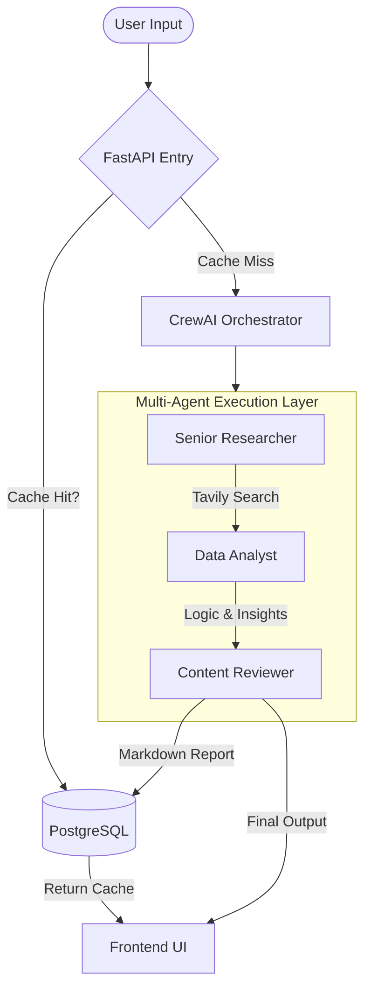

# AI Research Assistant (Multi-Agent System)

[](https://opensource.org/licenses/MIT)
[](https://nextjs.org/)
[](https://fastapi.tiangolo.com/)
[](https://www.crewai.com/)
[](https://deepmind.google/technologies/gemini/)

> **Automated Deep Research & Professional Report Generation.**  
> ระบบวิเคราะห์และสรุปข้อมูลอัจฉริยะด้วยทีม AI Agent นักวิจัย วิเคราะห์ และนักเขียนมืออาชีพ
> Link Demo: [Live Demo](https://ai-research-frontend-plum.vercel.app/)

---

## Key Features

- **Multi-Agent Orchestration**: Collaborative AI workflow using Researcher, Analyst, and Writer roles.
- **Real-time Web Search**: Integrated with Tavily Search AI for current, accurate data.
- **Premium User Experience**: Custom-built dashboard with glassmorphism, dark mode, and dynamic status tracking.
- **Professional Markdown Reports**: Staggered reveal animations with high-end typography and structured data tables.
- **Result Caching**: Integrated PostgreSQL database for lightning-fast retrieval of previous analyses.

---

## Tech Stack 

### Backend (Intelligence)
- **CrewAI**: Agent coordination and process management.
- **FastAPI**: High-performance asynchronous API layer.
- **Gemini 2.5 Flash Lite**: State-of-the-art LLM for lightning-fast reasoning.
- **PostgreSQL**: Advanced result caching and persistence via SQLAlchemy.
- **Tavily AI**: Optimized search API for LLM retrieval.

### Frontend (User Interface)
- **Next.js 15**: Robust React framework for production-grade apps.
- **Tailwind CSS 4**: Cutting-edge utility-first styling.
- **Framer Motion**: Immersive layout transitions and animations.
- **Lucide React**: Premium iconography for an "Agentic" feel.

---

## System Architecture (Agent Workflow)



---

## Installation & Setup

### Prerequisites
- Python 3.10+
- Node.js 18+
- PostgreSQL Instance
- API Keys: `GEMINI_API_KEY`, `TAVILY_API_KEY`, `DATABASE_URL`

### 1. Backend Setup
```bash
# Clone the repository
git clone https://github.com/xhier2547/ai-research-assistant.git
cd ai-research-assistant

# Create virtual environment
python -m venv venv
source venv/bin/activate  # venv\Scripts\activate on Windows

# Install dependencies
pip install -r requirements.txt

# Start FastAPI server
uvicorn api:app --reload
```

### 2. Frontend Setup
```bash
cd frontend

# Install dependencies
npm install

# Run development server
npm run dev
```

---

## 🇹🇭 คำอธิบายโปรเจกต์ (Thai Description)

โปรเจกต์นี้เป็นระบบ **AI Research Assistant** ที่ทำงานด้วยสถาปัตยกรรม **Multi-Agent (CrewAI)** โดยแบ่งหน้าที่การทำงานออกเป็น 3 ส่วนหลัก:
1. **Researcher Agent**: ค้นหาข้อมูลล่าสุดจากอินเทอร์เน็ตเชิงลึก เพื่อหาแหล่งข้อมูลที่เชื่อถือได้
2. **Analyst Agent**: นำข้อมูลดิบมาวิเคราะห์หา Insight, แนวโน้ม และสรุปประเด็นสำคัญ
3. **Writer Agent**: เรียบเรียงบทความสรุปในรูปแบบ Markdown ที่สวยงาม มีตารางเปรียบเทียบ และสรุปฟันธงที่เป็นประโยชน์

ตัวหน้าเว็บ (Frontend) ถูกออกแบบมาให้มีความเป็น **Premium AI Interface** มีการแสดงสถานะการทำงานของ Agent แต่ละตัวแบบ Real-time เพื่อประสบการณ์การใช้งานที่ยอดเยี่ยม

---

## License
Distributed under the MIT License. See `LICENSE` for more information.

## 🤝 Contact
QIER - [@xhier2547](https://github.com/xhier2547)

---
*Built with ❤️ by Multi-Agent Synergy*
